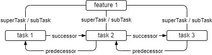

# Entwicklung modularer Software mit Java

Modularisierung ist ein wichtiges Qualitätsmerkmal für große Softwaresysteme. Sie verbessert die Möglichkeit, diese zu verstehen, erhöht dadurch ihre Beherrschbarkeit und trägt zu deren effektiverer Wart-, Test- und Erweiterbarkeit bei.

Dieser Beitrag beschreibt unzureichende Modularisierung als eine Ursache für die Schwierigkeit, komplexe Software zu beherrschen und wie es insbesondere in Java-Anwendungen zu Defiziten in der Modularisierung kommt. Der Beitrag zeigt ausserdem Strategien für Modularisierung in Java auf und liefert Beispiele für deren praktische Umsetzung.

## Komplexität in Softwaresystemen

Die Schwierigkeit, Softwaresysteme zu verstehen, zu warten, zu erweitern und zu testen liegt vor allem in deren Komplexität begründet. Was also macht ein Softwaresystem komplex?

Nicht selten ist vor allem die interne Struktur von Systemen dafür verantwortlich. Sie ist häufig gekennzeichnet durch eine kaum überschaubare Menge von direkten und indirekten internen Abhängigkeiten. Diese Abhängigkeiten machen es schwer vorherzusagen, welche Auswirkungen lokale Änderungen auf das Verhalten des Gesamtsystems haben.

## Softwarearchitektur

Eine zentrale Aufgabe von Softwarearchitektur ist, tragfähige Strukturen für große Systeme zu entwickeln. Bedeuten die beschriebenen Probleme also ein Scheitern der Softwarearchitektur?

Jein. Soll ein System entwickelt werden, entwerfen Softwarearchitekten meist sinnvolle Strukturen, die den bekannten Anforderungen genügen (v1 in **Abb. 1**).

<p align="center">
  
  <br/>
  <em>Abb. 1: Erosion einer Systemarchitektur</em>
</p>

Was passiert aber, wenn sich die Anforderungen ändern und neue hinzukommen oder alte wegfallen?

Dasselbe wie bei "klassischen" Architekturen für Gebäude, Städte, Infrastruktur, ... Zunächst tragfähige Lösungen kommen an ihre Grenzen:

<p align="center">
  
  <br/>
  <em>Abb. 2: Es wird eng ...</em>
</p>

Zu wenig Platz wie in **Abb. 2** ist bei Softwaresystemen heute normalerweise nicht das Problem. Wie schon gesagt, gibt es hier vor allem eine stetig wachsende Zahl von (internen) Abhängigkeiten. Ließen sich diese besser in den Griff kriegen, könnten auch große Systeme besser verstanden, verbessert, erweitert, getestet werden.

## Anpassungsfähige Systeme - Entworfen für Änderbarkeit

Gesucht wird also nach Ansätzen, die Softwaresysteme besser anpassbar machen. Moderne Softwaresysteme müssen erweiterbar sein, ohne dass dadurch ihre Komplexität Überhand nimmt. Die Zuverlässigkeit von Software muss durch Qualitätssicherung effektiv gesteigert werden, Software muss so entworfen werden, dass sie langfristig effektiv testbar ist. Solange aber innerhalb der Systeme zu viele Abhängigkeiten existieren, ist die Beherrschung dieser Abhängigkeiten ein Beitrag zur Lösung. Was hier Hoffnung macht ist, dass eine große Menge dieser Abhängigkeiten weder gewollt noch nötig ist.

Warum gibt es sie dann? Zwei Gründe sind zumindest für Java-basierte (Alt-) Systeme meist ausschlaggebend:

- Es kann bequem sein, zusätzliche Abhängigkeiten bewusst in Kauf zu nehmen, und
- es gibt kein zuverlässig wirksames Mittel, das das unbewusste, ungewollte Entstehen unnötiger Abhängigkeiten verhindert.

> Ein Beispiel für unnötige und aus Architektursicht ungewollte Abhängigkeiten findet man oft in den weit verbreiteten Schichtenarchitekturen für Java Enterprise Softwaresysteme. Die Architektur sieht hier meist eine eigene Softwareschicht vor, die den Zugriff auf die Datenhaltung steuert. Zu ihren Aufgaben gehören typischerweise die Einhaltung der Zugriffsberechtigungen, die zentrale Ressourcenverwaltung (connection-pooling), die Validierung von Ein- und Ausgabedaten für die persistente Datenhaltung, die Transaktionssteuerung zur Sicherstellung der Konsistenz, ....
> 
> Sehr häufig wird die Datenzugriffsschicht jedoch umgangen und es wird oft sowohl lesend als auch schreibend auf persistente Daten z. B. direkt aus den Klassen für die Benutzeroberfläche zugegriffen. Dadurch entsteht eine zusätzliche Abhängigkeit (siehe **Abb. 3**).
>

<p align="center">
  
  <br/>
  <em>Abb. 3: Architekturkonformer und nicht architekturkonformer Zugriff auf den data-layer ...</em>
</p>

Wie hat die Softwareindustrie darauf reagiert und wie erfolgreich ist bzw. war sie bis jetzt dabei, hochleistungsfähige und gleichzeitig flexibel anpassbare Systeme herzustellen?

## Klassische Ansätze - Kapselung in Java-Monolithen

Java-basierte Systeme wurden lange als sogenannte Monolithen ausgeliefert. Monolithen werden typischerweise als eine große Einheit entworfen, in der sich mehrere Teilsysteme befinden (Lego-Bausteine in **Abb. 3**, links). Der Monolith wird dabei in einer einzigen, großen Einheit erstellt und (in einem Applikationsserver) in einem einzigen Betriebssystemprozess ausgeführt.

<p align="center">
  
  <br/>
  <em>Abb. 3: Modulith - Ein Monolith aus Bausteinen</em>
</p>

Dies erleichtert vieles, hat aber auch seinen Preis: Innerhalb eines solchen Monolithen war es lange schwer, die enthaltenen Teilsysteme sauber voneinander zu trennen. So schlichen sich, bewusst oder unbewusst, unnötige Abhängigkeiten zwischen Teilsystemen ein (rechte Seite in **Abb. 3**). Viele Monolithen wurden so zu einem "big ball of mud", deren Wart-, Test- und Erweiterbarkeit zunehmend komplexer bis unmöglich wurden. Es gab schlicht keine effektiven und technisch wasserdichten Mechanismen, mit denen sich die Abhängigkeiten von Teilsystemen besser hätten kontrollieren und ggf. verhindern lassen können.

Sicher machte man sich konventionelle Konzepte wie Kapselung von Objektstruktur und -verhalten in Klassen und die Organisation von Code in Packages zunutze, um eine interne Struktur des Gesamtsystems herzustellen ([vgl. unten](#wie-code-in-java-strukturiert-wird---kapselung-durch-zugriffskontrolle-und-packages)). Bei Kapselung geht es im Wesentlichen darum, unnötige und unerwünschte Abhängigkeiten zu unterbinden. Die konventionellen Konzepte in Java sind aber letztlich zu durchlässig, um die Einhaltung der Strukturen, also die Sicherstellung einer konsistenten Architektur, systemweit zu erzwingen.

Vieles beruhte nämlich auf Einhaltung von Konventionen. (Unbewusste) Verstösse mussten dabei erst einmal mit viel Mühe erkannt werden, bevor sie korrigiert werden konnten. Tools wie z. B. [archunit](https://www.archunit.org/) ermöglichen eine automatisierte und regelbasierte Unterstützung dabei, die Regeln aber müssen für jedes System korrekt und möglichst vollständig konfiguriert und getestet werden. Ist die automatisierte Überprüfung der Systemstruktur in den Buildprozess integriert, erhält man frühzeitig Hinweise auf Verstöße. Natürlich darf in solchen Fällen nicht einfach die entsprechende Regel gelockert oder gar deaktiviert werden. Stattdessen muss der Code so geändert (refaktorisiert) werden, dass die Regeln eingehalten werden. Das ist natürlich nicht immer einfach, aber es war lange der einzige Weg, um die Modularisierung des Systems zu verbessern und damit die Beherrschbarkeit zu erhöhen.

### Wie Code in Java strukturiert wird - Kapselung durch Zugriffskontrolle und Packages

Um dem Wildwuchs an Abhängigkeiten ("big ball of mud") besser Herr zu werden, strukturiert man Java Code schon lange in Konstrukte wie ```interface```s, ```class```es und ```package```s und verwendet access level (```public```, ```protected```, ```private``` ...), um Zugriff auf interne Teile dieser Einheiten gezielt zu steuern und ggf. zu unterbinden.

<div align="center">

<table style="margin: auto;">
  <thead>
    <tr>
      <th style="text-align: left;">Access Modifier</th>
      <th style="text-align: center;">Innerhalb der Klasse</th>
      <th style="text-align: center;">Innerhalb des Packages</th>
      <th style="text-align: center;">Subklassen</th>
      <th style="text-align: center;">Von überall</th>
    </tr>
  </thead>
  <tbody>
    <tr>
      <td style="text-align: left;"><code>public</code></td>
      <td style="text-align: center;">✅</td>
      <td style="text-align: center;">✅</td>
      <td style="text-align: center;">✅</td>
      <td style="text-align: center;">✅</td>
    </tr>
    <tr>
      <td style="text-align: left;"><code>protected</code></td>
      <td style="text-align: center;">✅</td>
      <td style="text-align: center;">✅</td>
      <td style="text-align: center;">✅</td>
      <td style="text-align: center;">❌</td>
    </tr>
    <tr>
      <td style="text-align: left;"><code>default</code></td>
      <td style="text-align: center;">✅</td>
      <td style="text-align: center;">✅</td>
      <td style="text-align: center;">❌</td>
      <td style="text-align: center;">❌</td>
    </tr>
    <tr>
      <td style="text-align: left;"><code>private</code></td>
      <td style="text-align: center;">✅</td>
      <td style="text-align: center;">❌</td>
      <td style="text-align: center;">❌</td>
      <td style="text-align: center;">❌</td>
    </tr>
  </tbody>
</table>

<p><strong>Tab. 1:</strong> Übersicht der Zugriffsebenen in Java (<code>default</code> entspricht keinem Modifier, aka Modifier <code>package</code>)</p>

</div>

Diese Einheiten werden als (Lego-) Bausteine aufgefasst, aus denen sich größere Konstruktionen zusammensetzen lassen. Benutzer der größeren Einheiten sollen dabei keinen direkten Zugriff auf die internen Bausteine der Einheiten haben, es sei denn, der Zugriff wird über eine öffentliche Schnittstelle explizit erlaubt. Code wird also so organisiert, dass große Bausteine aus kleineren zusammengesetzt werden können. Dieses Muster lässt sich natürlich beliebig oft wiederholen.

Leider zeigt sich schnell, dass die beschriebenen Mechanismen nicht ausreichend sind, um die Entstehung von big balls of mud wirksam zu verhindern (vgl. **Abb. 3** rechter Teil).

Dies liegt unter anderem an einem Mangel der java-```package```s: Will man eine Klasse in einem ```package``` von ausserhalb des ```package```s nutzbar machen, muss man die Klasse öffentlich (```public```) machen. Und genau das ermöglicht ja erst das beschriebene Bausteinprinzip. Es gab aber lange (zumindest in Standard-Java) keinen Mechanismus, um die Sichtbarkeit von ```package```s zu kontrollieren: Gibt es in einem ```package``` eine Klasse, die in einem anderen ```package``` verwendet werden soll, muss, wie gesagt, die Klasse ```public``` gemacht werden. Damit ist sie aber öffentlich für ALLE Systemteile, in denen das zugehörige ```package``` direkt oder indirekt verwendet werden kann.

> Da hilft es auch nicht, sein Gesamtsystem etwa mit dem Buildtool maven in einem multi-module-Projekt bauen zu lassen: maven Module bieten keine zusätzliche Kapselung für Java-Projekte.

Genau dies ist aber ein Ausgangspunkt für die Entstehung von big balls of mud: Früher oder später wird es dazu kommen, dass die Klasse von (weit entfernten) Stellen aus verwendet wird, die eigentlich keinen Zugriff haben sollten, da die Klasse für sie ein zu verbergendes Implementierungsdetail eines größeren Bausteins ist.

## Microservices

Mehrere Probleme monolithischer Systeme ([siehe "Kapselung in Java-Monolithen"](#klassische-ansätze---kapselung-in-java-monolithen)) haben vor Jahren das Aufkommen von Microservices stark begünstigt.

Microservices verfolgen insbesondere bei der Kapselung von Code einen rigoroseren Ansatz als herkömmliche Systemarchitekturen: Für jeden Microservice wird eine (oft plattformunabhängige) Schnittstelle vereinbart. Die Implementierung dieser Schnittstelle erfolgt vollständig autonom, bis hin zur Wahl der verwendeten Technologie. Auch teilen sich Microservices nicht einen gemeinsamen Betriebssystemprozess, sondern jeder bekommt exklusiv einen eigenen. Offensichtlich werden so unerwünschte Querverbindungen zwischen den Teilsystemen, also solche, die nicht dessen Schnittstelle verwenden, kategorisch unterbunden. Auf diese Weise lässt sich ein sehr hoher Grad an Modularisierung erreichen. Es zeigte sich aber, dass mit wachsender Zahl von Microservices die Komplexität an anderen Stellen, z. B. bei der benötigten Infrastruktur und deren Management, enorm steigt.

Warum ist das so?

Der Grund liegt in einem typischen Merkmal von Microservices: Diese sind üblicherweise tatsächlich klein - so klein, dass sie isoliert von der Aussenwelt wenig Sinn erbringen. Typischerweise laufen Microservices daher in einem Netzwerk aus Microservices, oft in sogenannten Containern ([z. B. docker](https://www.docker.com/)). Im Netzwerk kommunizieren die Microservices untereinander und stellen so die mächtige Funktionalität heutiger Softwaresysteme zur Verfügung. Deren Mächtigkeit steht dabei zunächst im Kontrast zur Kleinheit der Microservices. Es liegt auf der Hand, dass es eine große Anzahl von Microservices braucht, um heutige Systeme zu bauen.

Natürlich steigt mit wachsender Zahl von Microservices / Containern / Prozessen die Komplexität, diese zu beherrschen. In einem vernetzten System von eigenständigen Betriebssystemprozessen muss über viele Aspekte ganz neu nachgedacht werden: Wie wird mit der Latenz bei der Netzwerkkommunikation umgegangen? Wie erkennt das Gesamtsystem den Ausfall einzelner Komponenten und wie reagiert es darauf? Wird die Konsistenz ggf. redundanter Daten hergestellt und falls ja, wie? Wie lassen sich Transaktionen über Prozessgrenzen realisieren? Um all dem zu begegnen, entstand eine Vielzahl von zum Teil konkurrierenden Konzepten, Tools und Technologien (z. B. [kubernetes](https://kubernetes.io/)) und natürlich entsprechenden Dienstleistungsangeboten.

Dies hinterließ bei vielen den Eindruck, dass die Komplexität von Microservices die der Monolithen deutlich übersteigt, wenn es sich hier auch um eine andere Art von Komplexität handelt. Das darf aber kein Grund sein, Microservices voreilig ad acta zu legen. Es muss eingeräumt werden, dass Modularisierung nicht das einzige Qualitätsmerkmal von guten Softwaresystemen ist. Neben diesem erhält man mit Microservices neue Möglichkeiten z.B. für die Skalierbarkeit und für das Deployment neuer Softwarefeatures.

Dennoch, die Kritik an Microservices führte nach einiger Zeit zu einer gegenläufigen Entwicklung mit Slogans wie "I want my monolith back". Tatsächlich tat sich gleichzeitig und unabhängig vom Trend zu Microservices auch einiges in Bezug auf Modularisierung im Java-Umfeld ([siehe unten](#modularisierung-mit-java)).

# Warum ist Modularisierung wichtig und was sind Module?

Das Schlüsselargument für Modularisierung ist Beherrschung von Komplexität auch in großen Systemen. Große monolithische Systeme weisen häufig problematische Merkmale wie starke Kopplung auf. Bei zu starker Kopplung sind Systemteile unnötiger und oft ungewollter Weise voneinander abhängig. Viele dieser Abhängigkeiten entstehen unkontrolliert und so kommt es, dass schnell so viele existieren, dass große Teile des Systems nahezu unwartbar werden: Jede Änderung birgt die Gefahr von schwer kontrollierbaren Seiteneffekten in kaum vorhersehbaren Teilen des Systems. Dies wiederum führt dazu, dass die Kosten für Wartung und Erweiterung der Software explodieren.

Der Zugriff auf ein Modul ist wie bei den Microservices technisch nur über vom Modul selbst zur Verfügung gestellte Schnittstellen möglich. Das bedeutet, dass das Entstehen von unerwünschten Abhängigkeiten technisch unterbunden wird. Dadurch wird ein Modul zu einem Baustein, mit dem große Systeme hergestellt werden können. Die Gefahr, dass diese durch unkontrolliert entstehende Abhängigkeiten fragil bzw. unwartbar und nicht erweiterbar werden, ist deutlich reduziert.

> Es wäre ein Missverständnis einzuwenden, dass durch einfache Erweiterungen einer Modulschnittstelle der Zugriff auch auf interne Bereiche möglich wird. Das ist zwar technisch möglich, hier kommt allerdings zum Tragen, dass es in realen Projekten eine klare Verantwortlichkeit für Module gibt. Dadurch kann "organisatorisch" sichergestellt werden, dass Modulschnittstellen nicht von aussen und nicht beliebig verändert werden.

## Modulithen

Die oben nur kurz beschriebenen Eigenschaften von Monolithen auf der einen und Microservices auf der anderen Seite hinterlassen den Wunsch, die Vorteile beider Ansätze zu kombinieren und ihre jeweiligen Nachteile zu relativieren. 

Sollte es nicht möglich sein, Softwaresysteme zu konstruieren, die strukturell deutlich weniger komplex sind als die klassischen Monolithen, trotzdem aber deren einfachere Handhabbarkeit im Produktivbetrieb nutzen? Gibt es gleichzeitig eine Möglichkeit, bei Bedarf die Vorteile von Microservices z. B. in Sachen Skalierbarkeit mit einzubringen?

Dieser Beitrag zeigt, dass ein modular aufgebauter Monolith genau dies realisiert. Dieses Konzept taucht seit einiger Zeit in der Literatur unter dem Kunstbegriff "Modulith" auf.

Bevor dieses Konzept im Folgenden näher beschrieben wird, sollen zunächst konventionelle Ansätze zur Strukturierung und Kapselung von Code in Java vorgestellt werden.

## Modularisierung mit Java

Die Java-Plattform bietet seit Version 9 das Java Platform Module System ([JPMS](https://en.wikipedia.org/wiki/Java_Platform_Module_System)), das eine Möglichkeit für die Vermeidung von unkontrollierten internen Abhängigkeiten darstellt:

Mit JPMS können Entwickler Module definieren, die ausschließlich über eine selbst festgelegte Schnittstelle genutzt werden können und gleichzeitig den Zugriff auf interne Teile des Moduls unterbinden. Es ist also möglich, Module zu definieren, die nur über eine explizit definierte Schnittstelle von aussen zugreifbar sind. Der Zugriff auf interne Teile des Moduls ist dabei nicht möglich. Damit wird das Bausteinprinzip konsequent umgesetzt und gleichzeitig die Entstehung von big balls of mud verhindert.

Mit JPMS ist es sogar möglich, dass Module bis ins Detail selbst steuern, welche anderen Module auf welche Teile der bereitgestellten Schnittstelle zugreifen können. Die durchgängige Verwendung von Modulen erfordert dabei zwar im ersten Moment einen gewissen Zusatzaufwand, garantiert aber danach eine viel stabilere interne Struktur des Gesamtsystems. Dies wird erreicht, indem die beschriebene Inflation von (internen) Abhängigkeiten effektiv verhindert wird.

## Modulithen mit Java - Monolithische Systeme aus Modulen

<p align="center">
  
  <br/>
  <em>Abb. 4: Modulith - Ein Monolith aus Modulen</em>
</p>

**Abb. 4** zeigt, wie aus einem komplexer werdenden monolithischen System ein Modulith wird: Teilsysteme innerhalb des Monolithen werden zu Modulen.

Was ist hier der entscheidende Punkt?

Durch die Modulgrenzen kann der (willkürliche, ungewollte, unerwünschte) Zugriff auf Internas eines Moduls konsequent unterbunden werden! Ein Modul kann _selbstständig_ sicherstellen, dass ein Zugriff von ausserhalb des Moduls auch auf ```public``` Internas (Klassen, Interfaces, Enums) nicht möglich ist.

> Innerhalb eines Moduls müssen oft viele Typen ```public``` sein, wenn es in dem Modul mehrere ```packages``` gibt.

## Modulithen plus Microservices

Bevor im Folgenden ein konkretes Beispiel vorgestellt wird noch eine Bemerkung zu Microservices: Selbstverständlich ist es möglich und häufig auch sinnvoll, Modulithen mit Microservices zu kombinieren. Dies kommt immer dann in Betracht, wenn für bestimmte Systemteile Kriterien wie Skalierbarkeit wichtig sind. Microservices skalieren besser als Modulithen. Ausserdem erweisen sie sich als vorteilhaft, wenn Teilsysteme häufig und schnell geändert werden müssen. Modulithen sind vergleichsweise große Deploymenteinheiten, die oft längere Releasezyklen haben, als die kleineren Microservices. Insofern ist eine Koexistenz von Modulithen und Microservices keineswegs unüblich.

# Ein Anwendungsbeispiel - jeeeraaah

Im Projekt jeeeraaah geht es im Kern um die Verwaltung von Aufgaben (Tasks) und die Planung von Arbeitsabläufen. Dazu sollen zusammengehörige Tasks in Gruppen (TaskGroup) organisiert werden. **Abb. 5** zeigt das zentrale Objektmodell:

<p align="center">
  
  <br/>
  <em>Abb. 5: TaskGroup - Task</em>
</p>

Die Idee ist, Aufgaben in Teilaufgaben zu gliedern (Tasks und SubTasks) und für alle Aufgaben Abläufe (Predecessor- und Successor-Tasks) planen zu können. 

<p align="center">
  
  <br/>
  <em>Abb. 6: Task-Objekte</em>
</p>

In der Anwendung sieht 

---------------- reviewed ----------------
