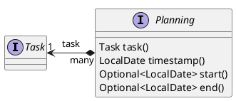
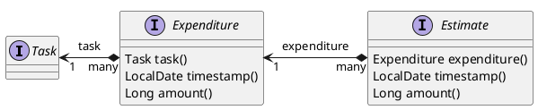

# jeeeraaah datamodel extended

## tasks and plannings

Task planning is subject to many influences that are often not fully known at the time of planning. As a result, plans are constantly being adjusted. For future planning, it can be interesting to see how planning assumptions for a task have changed.

Therefore ```Planning```s can be associated to ```Task```s in order to track changes in ```Task.start``` and ```Task.end``` until ```Task.closed``` was not set to ```true```.



## tasks and expenditure



Task planning is subject to many influences that are often not fully known at the time of planning. As a result, plans are constantly being adjusted. For future planning, it can be interesting to see how planning assumptions for a task have changed.

Therefore ```Planning```s can be associated to ```Estimate```s (indirectly linked via ```Expenditure```) in order to track changes in ```Expenditure.amount``` until ```Task.closed``` was not set to ```true```.
