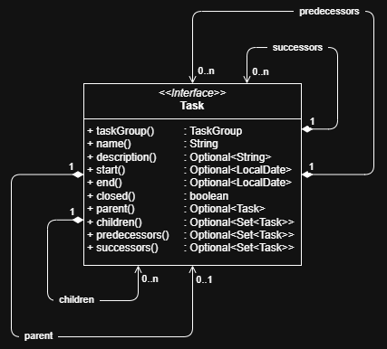

# jeeeraaah datamodel

## task and task group

The composition relation between ```TaskGroup``` and ```Task``` expresses, that at no time there is a ```Task``` that has no associated ```TaskGroup```[^1]. 


[^1]: Technically there is a very short timed temporary exception from this constraint when a ```Task``` is to be deleted from persistent storage.

[//]: # (```puml)

[//]: # (@startuml)

[//]: # ()
[//]: # (!pragma layout smetana)

[//]: # (skinparam linetype ortho)

[//]: # ()
[//]: # (interface Task)

[//]: # ({)

[//]: # (  central business object)

[//]: # (  --)

[//]: # (  TaskGroup taskGroup&#40;&#41;)

[//]: # (})

[//]: # ()
[//]: # (interface TaskGroup)

[//]: # ({)

[//]: # (  Tasks are grouped into TaskGroups)

[//]: # (  --)

[//]: # (  Set<Task> tasks&#40;&#41;)

[//]: # (})

[//]: # ()
[//]: # (TaskGroup "  1" *-r  "many" Task : "   tasks   ")

[//]: # ()
[//]: # (@enduml)

[//]: # (```)

## tasks in detail

```Task```s have a couple of relations to other ```Task```s as shown in the diagram below.

[//]: # (```puml)

[//]: # (@startuml)

[//]: # ()
[//]: # (' !pragma layout smetana)

[//]: # (' skinparam linetype ortho)

[//]: # (skinparam linetype polyline)

[//]: # (hide empty members)

[//]: # ()
[//]: # (interface Task)

[//]: # ({)

[//]: # (  @NonNull String    \t\t name&#40;&#41;)

[//]: # (  Optional<String>   \t\t description&#40;&#41;)

[//]: # (  Optional<LocalDate>  \t start&#40;&#41;)

[//]: # (  Optional<LocalDate>  \t end&#40;&#41;)

[//]: # (  Boolean            \t\t closed&#40;&#41;)

[//]: # (  @NonNull TaskGroup   \t group&#40;&#41;)

[//]: # (  Optional<Task>     \t\t parent&#40;&#41;)

[//]: # (  Optional<Set<Task>>  \t children&#40;&#41;)

[//]: # (  Optional<Set<Task>>  \t predecessors&#40;&#41;)

[//]: # (  Optional<Set<Task>>  \t successors&#40;&#41;)

[//]: # (})

[//]: # ()
[//]: # (Task -> Task : parent)

[//]: # (Task " 1" *-> " many" Task : children)

[//]: # (Task " 1" *-> " many" Task : predecessors)

[//]: # (Task " 1" *-> " many" Task : successors)

[//]: # ()
[//]: # (@enduml)

[//]: # (```)



The fields are pretty self explaining. However there is one thing to mention with regard to the ```boolean``` field ```closed``` in ```Task```. If it is ```true``` the fields ```start``` and ```end``` are no longer regarded as schedule information but as timestamps for the effective action carried out. Note that in general it is not assumed that the timestamps correspond to the effective amount of time the action required. It can be less than the period between the timestamps.

## task object relations

[//]: # (```puml)

[//]: # (@startuml)

[//]: # ()
[//]: # (' !pragma layout smetana)

[//]: # (' skinparam linetype ortho)

[//]: # (skinparam linetype polyline)

[//]: # (hide empty members)

[//]: # ()
[//]: # (interface Task)

[//]: # (object MainTask)

[//]: # (object SubTask1)

[//]: # (object SubTask2)

[//]: # (object SubTask3)

[//]: # ()
[//]: # (MainTask --u|> Task)

[//]: # (SubTask1 --u|> Task)

[//]: # (SubTask2 --u|> Task)

[//]: # (SubTask3 --u|> Task)

[//]: # ()
[//]: # (MainTask --> SubTask1 : child)

[//]: # (MainTask --> SubTask2 : child)

[//]: # (MainTask --> SubTask3 : child)

[//]: # ()
[//]: # (SubTask1 --> MainTask : child)

[//]: # (SubTask2 --> MainTask : child)

[//]: # (SubTask3 --> MainTask : child)

[//]: # ()
[//]: # (SubTask2 -l> SubTask1 : predecessor)

[//]: # ('SubTask2 -[hidden]- SubTask1)

[//]: # (SubTask1 -r> SubTask2 : successor)

[//]: # (SubTask3 -l> SubTask2 : predecessor)

[//]: # ('SubTask3 -[hidden]- SubTask2)

[//]: # (SubTask2 -r> SubTask3 : successor)

[//]: # ()
[//]: # (@enduml)

[//]: # (```)


